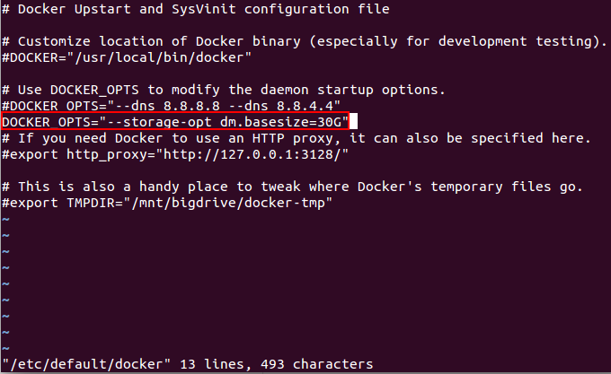
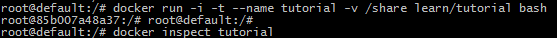
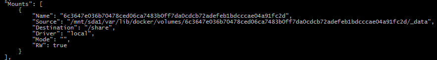
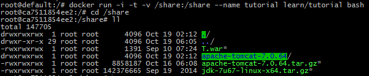

#Docker
##容器
###扩容
Docker默认为容器分配10G的存储空间，显然这不能满足日常的需求。有两种办法解决这一问题：
1. 静态扩容  
2. 动态扩容
####静态扩容
修改docker配置文件，在Ubuntu系统中的配置文件为/etc/default/dockerfile。添加配置`DOCKER_OPTS="--storage-opt dm.basesize=30G"`将默认容器空间改为30G  
  

*参考：*  
静态扩容：[https://sasikanthkotti.wordpress.com/category/docker/](https://sasikanthkotti.wordpress.com/category/docker/)  
动态扩容：[http://www.linuxeye.com/Linux/2114.html](http://www.linuxeye.com/Linux/2114.html)  
##Docker数据管理
在容器中管理数据主要有两种方式：  
1. 数据卷  
2. 数据卷容器
###数据卷
数据卷是一个可供一个或多个容器使用的特殊目录，它绕过 UFS，可以提供很多有用的特性：  
- 数据卷可以在容器之间共享和重用  
- 对数据卷的修改会立马生效  
- 对数据卷的更新，不会影响镜像  
- 卷会一直存在，直到没有容器使用  
数据卷的使用，类似于 Linux 下对目录或文件进行 mount  

####创建数据卷  
- -v  
在创建容器时，通过-v参数来创建一个数据卷并挂载到容器中  
具体又分为两种方式：  
	1. -v [container path]  
例如：将/share目录作为数据卷挂载到容器中：
	`docker run -i -t  --name tutorial -v /share learn/tutorial `  
我们可以通过`docker inspect` 命令查看数据卷在主机中的位置：  
  
你将看到形如下图的数据卷在主机中的位置：  
  
这样我们就可以“方便的”在这么深的文件目录中操作传输文件  
	2. 挂载主机指定目录作为数据卷  
我们可以指定主机上的目录作为数据卷而避免上述方法的繁琐。同样的，在创建容器时，通过`-v [host file path] : [container file path]`参数来创建数据卷  
  

- Dockerfile VOLUME  
在Dockerfile文件中，使用VOLUME [container path]的形式创建数据卷，效果同上述第一种方式。  
##Dockerfile
###Dockerfile实例
1. 支持SSH服务容器  
	`FROM ubuntu:14.04`  
	`MAINTAINER Sven Dowideit <SvenDowideit@docker.com>`  
	`RUN apt-get update && apt-get install -y openssh-server`  
	`RUN mkdir /var/run/sshd`  
	`RUN echo 'root:screencast' | chpasswd`  
	`RUN sed -i 's/PermitRootLogin without-password/PermitRootLogin yes/' /etc/ssh/sshd_config`  
	`# SSH login fix. Otherwise user is kicked off after login`  
	`RUN sed 's@session\s*required\s*pam_loginuid.so@session optional pam_loginuid.so@g' -i /etc/pam.d/sshd`  
	`ENV NOTVISIBLE "in users profile"`  
	`RUN echo "export VISIBLE=now" >> /etc/profile`  
	`EXPOSE 22`  
	`CMD ["/usr/sbin/sshd", "-D"]`  
##Docker实战
###安装
####Windows(仅作学习练习使用)
1. 到[https://www.docker.com/toolbox](https://www.docker.com/toolbox)下载Docker Toolbox（支持Mac OS X 10.8+ 和 Windows(64bit) 7+）软件并安装，安装过程中记得勾选安装VirtualBox虚拟机，将会自动在虚拟机中安装CentOS系统。  
2. 通过Docker Quickstart Terminal启动程序，第一次启动较慢，因为要拉起虚拟机启动CentOS系统。  CentOS中已经安装好了docker，我们可以通过命令查看:  
	`docker version`  
  
3. 为了方便操作，我们为CentOS挂在本地共享目录。  
  

4. 将共享目录挂载到CentOS中的/share目录, VMShare为主机共享文件夹名称，/share为CentOS挂载目录  
	`mkdir /share`  
	`sudo mount –t vboxsf VMShare /share`  
测试：  
	`cd /share`  
	`ll`  
  
####Ubuntu
当前系统版本号为Ubuntu 14.04  
有两种Docker方式：
- 通过系统自带安装包
	Ubuntu系统中自带Docker包，但通过此种方式安装的Docker版本较低，所以不推荐，这里不再累述
- 通过Docker源安装
	依次输入以下命令：  
    `sudo apt-key adv --keyserver hkp://keyserver.ubuntu.com:80 --recv-keys 36A1D7869245C8950F966E92D8576A8BA88D21E9`  
    `sudo bash -c "echo deb https://get.docker.io/ubuntu docker main >   /etc/apt/sources.list.d/docker.list"`  
	`sudo apt-get update`  
	`sudo apt-get install lxc-docker`  
    最后确认是否安装成功：docker version  
  
	- 免sudo操作Docker  
		每次使用Docker，都要在命令前加sudo（表示获取root权限执行），特别不方便，为此，我们将当前用户加入到docker group中即可  
        `sudo groupadd docker` #创建docker group  
        `sudo gpasswd -a impler docker` #将当前用户加入到docker group  
        `sudo service docker restart` #重启docker服务  

####安装JDK
1. 使用Dockerfile文件创建镜像
2. 为了提高效率，采用非在线安装方式，即先下载jdk压缩文件，然后解压，设置环境变量
3. 编辑Dockerfile文件，注意应该在~目录(root用户为/root，普通用户为/home)下创建编辑Dockerfile
	`vi Dockerfile`  
Dockerfile内容如下:  
	`from centos` #基础镜像  
	`maintainer imper <704090860@qq.com>` #签名  
	`run mkdir /opt/java` #创建java安装目录  
	`copy jdk-7u67-linux-x64.tar.gz . /opt/java/` #将压缩包拷贝到指定目录  
	`workdir /opt/java` #切换工作目录  
	`run tar zxvf jdk-7u67-linux-x64.tar.gz` #解压到当前目录下  
	`ENV JAVA_HOME /opt/java/jdk1.7.0_67` #设置环境变量  
	`ENV PATH $PATH:$JAVA_HOME/bin`  
  
ESC+:wq保存退出  
*注意：*经测试copy 命令只能拷贝与Dockerfile同级目录文件，所以在编写Dockerfile文件之前，先把jdk压缩包拷贝到Dockerfile同级目录  
4. 创建镜像  
	`docker build [option] [image name] .` #根据Dockerfile配置，生成镜像  
  
5. 启动容器并测试  
	`docker run -i -t --name hello hello-java`  
	`java -version`
  

###在容器与主机之间传输文件
####从主机拷贝文件到容器中
1. 使用命令 sudo cp [host file path] /var/lib/docker/aufs/mnt/[full container id]/[target file path]  
	`sudo cp /share/apache-tomcat-7.0.64.tar.gz /var/lib/docker/aufs/mnt/eaf8779...c8a7ee/opt/tomcat/tomcat.tar.gz`  

####从容器拷贝文件到容器中
1. 使用命令 sudo cp [full container id]:/[file path in container] /[host path]  
	`sudo cp eaf8779...c8a7ee:/opt/tomcat/tomcat.tar.gz /opt/tomcat/`  

##Docker常用命令

- docker version: 显示docker版本
- docker images: 显示所有已安装的镜像
- docker search [镜像名称关键字]: 在官方仓库中搜索镜像。docker search tutorial
- docker pull [镜像名称]: 从仓库中下载镜像，镜像名称按照用户名/镜像名的方式存储。docker pull learn/tutorial
- docker run [镜像名称] [命令参数]: 运行镜像。docker run learn/tutorial echo "hello world"
- apt-get install -y [程序名称]: 在容器中安装新的程序。docker run learn/tutorial apt-get install -y ping
- docker ps -l: 显示容器信息列表
- docker inspect [容器ID]: 显示具体容器信息，容器ID可用其前几（3, 4）个标识符表示
- docker commit [容器ID] [新的镜像名称]: 保存对容器的修改，生成新的镜像，容器ID可用其前几（3, 4）个标识符代替。docker commit 0fea learn/ping
- docker push [镜像名称]: 发布镜像到官方仓库