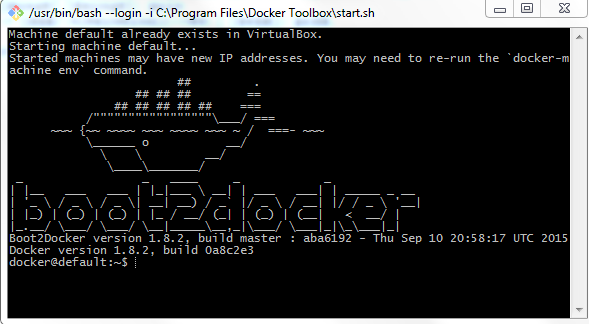
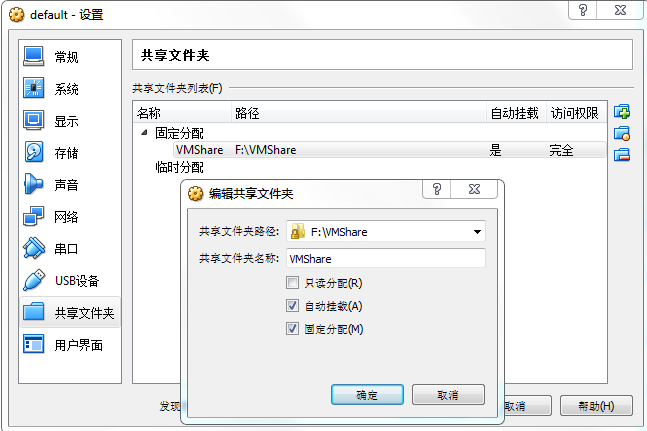
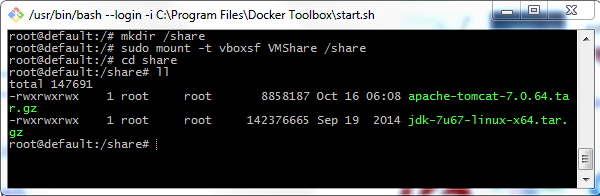
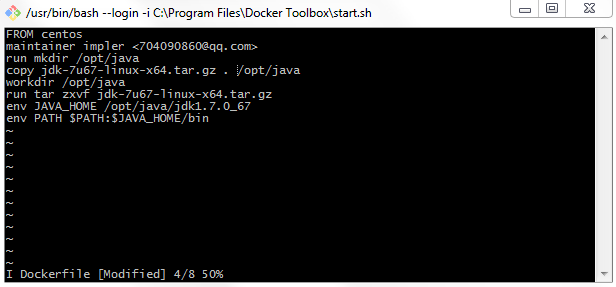
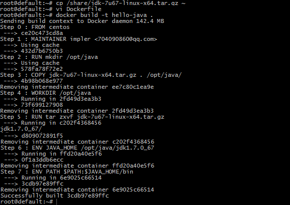
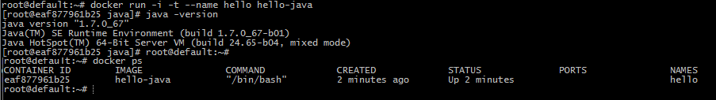
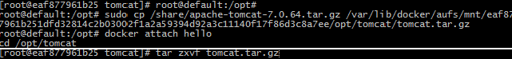
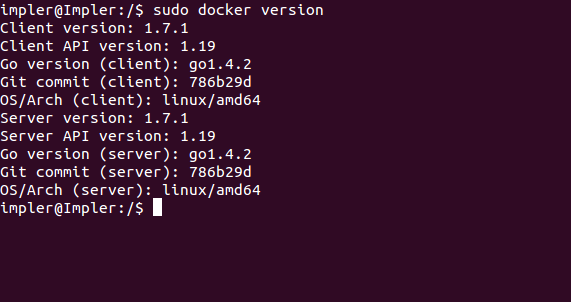

#Docker

##Docker实战
###在windows中使用Docker
####安装
1. 到https://www.docker.com/toolbox下载Docker Toolbox（支持Mac OS X 10.8+ 和 Windows(64bit) 7+）软件并安装，安装过程中记得勾选安装VirtualBox虚拟机，将会自动在虚拟机中安装CentOS系统。  
2. 通过Docker Quickstart Terminal启动程序，第一次启动较慢，因为要拉起虚拟机启动CentOS系统。  CentOS中已经安装好了docker，我们可以通过命令查看:  
	`docker version`  
  
3. 为了方便操作，我们为CentOS挂在本地共享目录。  
  

4. 将共享目录挂载到CentOS中的/share目录, VMShare为主机共享文件夹名称，/share为CentOS挂载目录  
	`mkdir /share`  
	`sudo mount –t vboxsf VMShare /share`  
测试：  
	`cd /share`  
	`ll`  
  

####安装JDK
1. 使用Dockerfile文件创建镜像
2. 为了提高效率，采用非在线安装方式，即先下载jdk压缩文件，然后解压，设置环境变量
3. 编辑Dockerfile文件，注意应该在~目录(root用户为/root，普通用户为/home)下创建编辑Dockerfile
	`vi Dockerfile`  
Dockerfile内容如下:  
	`from centos` #基础镜像  
	`maintainer imper <704090860@qq.com>` #签名  
	`run mkdir /opt/java` #创建java安装目录  
	`copy jdk-7u67-linux-x64.tar.gz . /opt/java/` #将压缩包拷贝到指定目录  
	`workdir /opt/java` #切换工作目录  
	`run tar zxvf jdk-7u67-linux-x64.tar.gz` #解压到当前目录下  
	`ENV JAVA_HOME /opt/java/jdk1.7.0_67` #设置环境变量  
	`ENV PATH $PATH:$JAVA_HOME/bin`  
  
ESC+:wq保存退出  
*注意：*经测试copy 命令只能拷贝与Dockerfile同级目录文件，所以在编写Dockerfile文件之前，先把jdk压缩包拷贝到Dockerfile同级目录  

4.启动容器并测试  
	`docker run -i -t --name hello hello-java`  
	`java -version`
  

####在现有容器中安装tomcat
#####从主机上拷贝文件到容器中
1. sudo cp [host file path] /var/lib/docker/aufs/mnt/[full container id]/[target file path]  
	`sudo cp /share/apache-tomcat-7.0.64.tar.gz /var/lib/docker/aufs/mnt/eaf8779...c8a7ee/opt/tomcat/tomcat.tar.gz`  

###在Ubuntu中使用docker
####安装
当前系统版本号为Ubuntu 14.04  
有两种Docker方式：
- 通过系统自带安装包
	Ubuntu系统中自带Docker包，但通过此种方式安装的Docker版本较低，所以不推荐，这里不再累述
- 通过Docker源安装
	依次输入以下命令：  
    `sudo apt-key adv --keyserver hkp://keyserver.ubuntu.com:80 --recv-keys 36A1D7869245C8950F966E92D8576A8BA88D21E9`
    `sudo bash -c "echo deb https://get.docker.io/ubuntu docker main > /etc/apt/sources.list.d/docker.list"`
	`sudo apt-get update`
	`sudo apt-get install lxc-docker`
    最后确认是否安装成功：docker version

##Docker常用命令

- docker version: 显示docker版本
- docker images: 显示所有已安装的镜像
- docker search [镜像名称关键字]: 在官方仓库中搜索镜像。docker search tutorial
- docker pull [镜像名称]: 从仓库中下载镜像，镜像名称按照用户名/镜像名的方式存储。docker pull learn/tutorial
- docker run [镜像名称] [命令参数]: 运行镜像。docker run learn/tutorial echo "hello world"
- apt-get install -y [程序名称]: 在容器中安装新的程序。docker run learn/tutorial apt-get install -y ping
- docker ps -l: 显示容器信息列表
- docker inspect [容器ID]: 显示具体容器信息，容器ID可用其前几（3, 4）个标识符表示
- docker commit [容器ID] [新的镜像名称]: 保存对容器的修改，生成新的镜像，容器ID可用其前几（3, 4）个标识符代替。docker commit 0fea learn/ping
- docker push [镜像名称]: 发布镜像到官方仓库