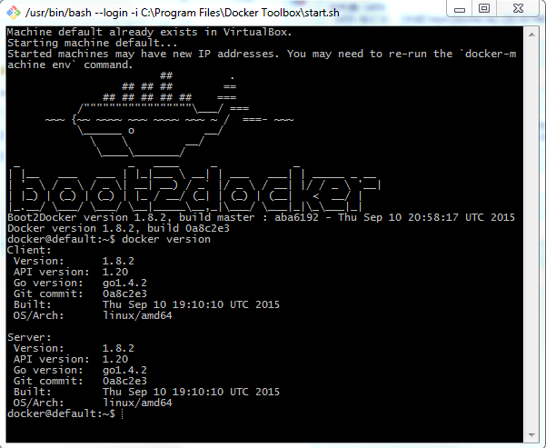
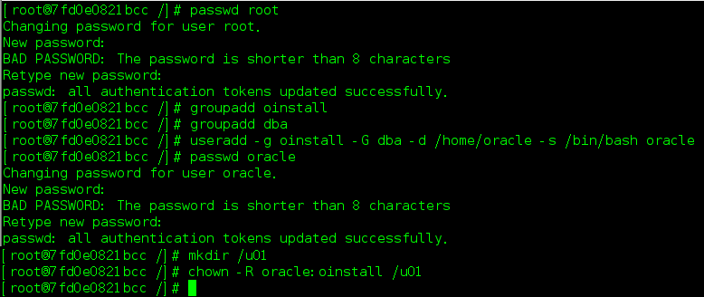
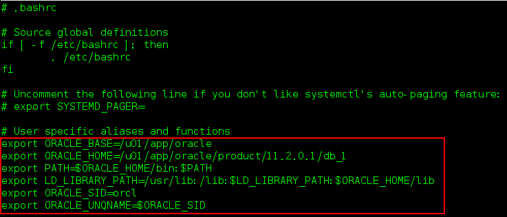
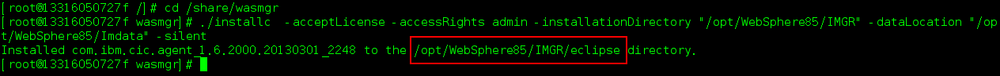

#Docker
##镜像
镜像是一个只读的模板。可以使用镜像创建容器。镜像中可以包含整个Linux操作系统，以及其他可以运行在操作系统中的应用。  
##容器
容器是应用的运行环境，相当于一个简易版Linux环境。容器由镜像创建，可以被启动、停止、删除。容器运行在docker引擎之上，相互隔离，互不影响。  
###扩容
Docker默认为容器分配10G的存储空间，显然这不能满足日常的需求。有两种办法解决这一问题：  
1. 静态扩容  
2. 动态扩容
####静态扩容
修改docker配置文件，在Ubuntu系统中的配置文件为/etc/default/dockerfile。添加配置`DOCKER_OPTS="--storage-opt dm.basesize=30G"`将默认容器空间改为30G  
  

*参考*  
静态扩容：[https://sasikanthkotti.wordpress.com/category/docker/](https://sasikanthkotti.wordpress.com/category/docker/)  
动态扩容：[http://www.linuxeye.com/Linux/2114.html](http://www.linuxeye.com/Linux/2114.html)  
##仓库
仓库是集中存放镜像的场所，概念与git类似。
##Docker数据管理
在容器中管理数据主要有两种方式：  
1. 数据卷  
2. 数据卷容器
###数据卷
数据卷是一个可供一个或多个容器使用的特殊目录，它绕过 UFS，可以提供很多有用的特性：  
- 数据卷可以在容器之间共享和重用  
- 对数据卷的修改会立马生效  
- 对数据卷的更新，不会影响镜像  
- 卷会一直存在，直到没有容器使用  
数据卷的使用，类似于 Linux 下对目录或文件进行 mount  

####创建数据卷  
- -v  
在创建容器时，通过-v参数来创建一个数据卷并挂载到容器中  
具体又分为两种方式：  
	1. -v [container path]  
例如：将/share目录作为数据卷挂载到容器中：
	`docker run -i -t  --name tutorial -v /share learn/tutorial `  
我们可以通过`docker inspect` 命令查看数据卷在主机中的位置：  
  
你将看到形如下图的数据卷在主机中的位置：  
  
这样我们就可以“方便的”在这么深的文件目录中操作传输文件  
	2. 挂载主机指定目录作为数据卷  
我们可以指定主机上的目录作为数据卷而避免上述方法的繁琐。同样的，在创建容器时，通过`-v [host file path] : [container file path]`参数来创建数据卷  
  

- Dockerfile VOLUME  
在Dockerfile文件中，使用VOLUME [container path]的形式创建数据卷，效果同上述第一种方式。  
##Dockerfile
用户可以使用Dockerfile自定义镜像  
###Dockerfile常用指令
- FROM Dockerfile的第一条指令，意为以哪个镜像为基础创建新的镜像  
	`FROM <image>`或`FROM <image>:<tag>`  
- MAINTAINER 标识维护者信息  
	`MAINTAINER <name>`  
- RUN 在当前镜像基础上执行命令，并提交为新的镜像  
	`RUN <command>`  --在shell终端中运行命令  
	或`RUN ['executable', 'param1', ...,'paramN']`  --使用exec执行命令  
- CMD 启动容器时执行的命令，每个Dockerfile只能有一条CMD命令，如果指定多条，只有最后一条会被执行。如果用户启动容器时指定了运行的命令(RUN)，将会覆盖CMD指定的命令  
	`CMD ['executable', 'param1', ...,'paramN']` --使用exec执行  
	`CMD <command> <param1> ... <paramN>` --在shell中执行，提供给需要交互的应用  
	`CMD ['param1', ..., paramN]` --提供给ENTRYPOINT的默认参数  
- EXPOSE 暴露容器端口  
	`EXPOSE <port1> ... <portN>`  
- ENV 指定环境变量，后续的RUN命令可以访问的到，并在容器运行时保持  
	`ENV <key> <value>`  
- ADD 将src复制到容器的dest中, src可以是Dockerfile所在目录的相对路径，也可以是URL，也可以是tar文件(自动解压为目录)  
	`ADD <src> <dest>`  
- COPY 复制本地住的的src到容器的dest中，src为Dockerfile所在目录的相对路径。当使用本地目录为源目录时，推荐使用COPY  
	`COPY <src> <dest>`  
- ENTRYPOINT 启动容器时指定的命令，并且不会被启动容器时指定的运行命令(RUN)覆盖，每个Dockerfile只能由一个ENTRYPOINT命令 
	`ENTRYPOINT ['executable', 'param1', ..., 'paramN']`  
	`ENTRYPPINT command param1 param2`  
- VOLUME 创建一个可以从本地主机或其他容器挂载的挂载点  
	`VOLUME ['<container directory>']`  
- USER 指定运行容器时的用户  
	`USER <username>`  
- WORKDIR 为RUN, CMD, ENTRYPOINT指令配置工作目录，如果使用相对路径，后面的路径则会基于前面的路径  
	`WORKDIR <directory>`  
- ONBUILD 配置当所创建的镜像作为其他新创建镜像的基础镜像时，所执行的操作指令  
###Dockerfile实例
1. 支持SSH服务容器(ubuntu)  
	`FROM ubuntu:14.04`  
	`MAINTAINER Sven Dowideit <SvenDowideit@docker.com>`  
	`RUN apt-get update && apt-get install -y openssh-server`  
	`RUN mkdir /var/run/sshd`  
	`RUN echo 'root:screencast' | chpasswd`  
	`RUN sed -i 's/PermitRootLogin without-password/PermitRootLogin yes/' /etc/ssh/sshd_config`  
	`# SSH login fix. Otherwise user is kicked off after login`  
	`RUN sed 's@session\s*required\s*pam_loginuid.so@session optional pam_loginuid.so@g' -i /etc/pam.d/sshd`  
	`ENV NOTVISIBLE "in users profile"`  
	`RUN echo "export VISIBLE=now" >> /etc/profile`  
	`EXPOSE 22`  
	`CMD ["/usr/sbin/sshd", "-D"]`  
2. 支持SSH服务容器(CentOS)  
	`FROM centos`  
	`RUN yum install -y openssh openssh-server openssh-clients httpd`  
	`RUN mkdir /var/run/sshd`  
	`RUN ssh-keygen -t rsa -f /etc/ssh/ssh_host_rsa_key`  
	`RUN ssh-keygen -t dsa -f /etc/ssh/ssh_host_dsa_key`  
	`RUN ssh-keygen -A`  
	`RUN /bin/echo 'root:root' |chpasswd`  
	`RUN /bin/sed -i 's/.*session.*required.*pam_loginuid.so.*/session optional pam_loginuid.so/g' /etc/pam.d/sshd`  
	`RUN /bin/echo -e "LANG=\"en_US.UTF-8\"" > /etc/default/local`  
	`EXPOSE      22`  
	`CMD /usr/sbin/sshd -D`  

##Docker实战  
###安装  
####Windows(仅作学习练习使用)  
1. 到[https://www.docker.com/toolbox](https://www.docker.com/toolbox)下载Docker Toolbox（支持Mac OS X 10.8+ 和 Windows(64bit) 7+）软件并安装，安装过程中记得勾选安装VirtualBox虚拟机，将会自动在虚拟机中安装CentOS系统。  
2. 通过Docker Quickstart Terminal启动程序，第一次启动较慢，因为要拉起虚拟机启动CentOS系统。  CentOS中已经安装好了docker，我们可以通过命令查看:  
	`docker version`  
  
3. 为了方便操作，我们为CentOS挂在本地共享目录。  
  

4. 将共享目录挂载到CentOS中的/share目录, VMShare为主机共享文件夹名称，/share为CentOS挂载目录  
	`mkdir /share`  
	`sudo mount –t vboxsf VMShare /share`  
测试：  
	`cd /share`  
	`ll`  
  

####Ubuntu
当前系统版本号为Ubuntu 14.04  
有两种Docker方式：
- 通过系统自带安装包
	Ubuntu系统中自带Docker包，但通过此种方式安装的Docker版本较低，所以不推荐，这里不再累述
- 通过Docker源安装
	依次输入以下命令：  
    `sudo apt-key adv --keyserver hkp://keyserver.ubuntu.com:80 --recv-keys 36A1D7869245C8950F966E92D8576A8BA88D21E9`  
    `sudo bash -c "echo deb https://get.docker.io/ubuntu docker main >   /etc/apt/sources.list.d/docker.list"`  
	`sudo apt-get update`  
	`sudo apt-get install lxc-docker`  
    最后确认是否安装成功：docker version  
  
	- 免sudo操作Docker  
		每次使用Docker，都要在命令前加sudo（表示获取root权限执行），特别不方便，为此，我们将当前用户加入到docker group中即可  
        `sudo groupadd docker` #创建docker group  
        `sudo gpasswd -a impler docker` #将当前用户加入到docker group  
        `sudo service docker restart` #重启docker服务  

####安装JDK
1. 使用Dockerfile文件创建镜像
2. 为了提高效率，采用非在线安装方式，即先下载jdk压缩文件，然后解压，设置环境变量
3. 编辑Dockerfile文件，注意应该在~目录(root用户为/root，普通用户为/home)下创建编辑Dockerfile
	`vi Dockerfile`  
Dockerfile内容如下:  
	`from centos` #基础镜像  
	`maintainer imper <704090860@qq.com>` #签名  
	`run mkdir /opt/java` #创建java安装目录  
	`copy jdk-7u67-linux-x64.tar.gz . /opt/java/` #将压缩包拷贝到指定目录  
	`workdir /opt/java` #切换工作目录  
	`run tar zxvf jdk-7u67-linux-x64.tar.gz` #解压到当前目录下  
	`ENV JAVA_HOME /opt/java/jdk1.7.0_67` #设置环境变量  
	`ENV PATH $PATH:$JAVA_HOME/bin`  
  
ESC+:wq保存退出  
*注意：*经测试copy 命令只能拷贝与Dockerfile同级目录文件，所以在编写Dockerfile文件之前，先把jdk压缩包拷贝到Dockerfile同级目录  
4. 创建镜像  
	`docker build [option] [image name] .` #根据Dockerfile配置，生成镜像  
  
5. 启动容器并测试  
	`docker run -i -t --name hello hello-java`  
	`java -version`
  

####静默安装Oracle11g  
#####准备
- 操作系统：CentOS Linux release 7.1.1503 (Core)  
- Oracle: linux.x64\_11gR2\_database\_1of2.zip linux.x64\_11gR2\_database\_2of2.zip  

#####安装  

1. 创建基础容器  
基于本地CentOS镜像 创建基础镜像，并指定数据卷用于文件传输， 暴露1521端口用于远程访问  
	`docker run -it -p 1521:1521 -v /share:/share --privileged centos`  
2. 安装依赖  
	`yum install binutils compat-libstdc++-33 elfutils-libelf elfutils-libelf-devel elfutils-libelf-devel-static gcc gcc-c++ glibc glibc-common glibc-devel glibc-headers kernel-headers ksh libaio libaio-devel libgcc libgomp libstdc++ libstdc++-devel make sysstat unixODBC unixODBC-devel`  
3. 创建Oracle用户和组  
	- 首先为root用户设置密码  
		`passwd root`  
	如果passwd命令还未安装，先安装passwd命令：`yum install passwd`
	- 创建oracle用户和组  
		`groupadd oinstall`  
		`groupadd dba`  
		`useradd -g oinstall -G dba -d /home/oracle -s /bin/bash oracle`  
	为oracle用户设置密码  
		`passwd oracle`  
	- 创建oracle安装目录，并赋予oracle用户权限  
		`mkdir /u01`  
		`chown -R oracle:oinstall /u01`  
	  

4. 修改内核参数  
	- 修改/etc/sysctl.conf 文件  
		`vi /etc/sysctl.conf`  
		修改以下参数：  
			- kernel.shmall = 2097152				//系统一次可以使用的共享内存总量  
			- kernel.shmmax = 2147483648			//共享内存段的最大尺寸  
			- kernel.shmmni = 4096					//设置系统范围内共享内存段的最大数量  
			- kernel.sem = 250 32000 100 128		//设置的信号量  
			- fs.file-max = 65536    						//文件句柄的最大数量  
			- fs.aio-max-nr = 1048576    					//同时可以拥有的的异步IO请求数目  
			- net.ipv4.ip_local_port_range = 1024 65000		//应用程序可使用的Ipv4端口范围  
		脚本如下：  
		`fs.aio-max-nr = 1048576`  
		`fs.file-max = 6815744`  
		`kernel.shmall = 2097152`  
		`kernel.shmmax = 536870912`  
		`kernel.shmmni = 4096`  
		`kernel.sem = 250 32000 100 128`  
		`net.ipv4.ip_local_port_range = 9000 65500`  
		运行`sysctl -p`，使设置立即生效
	- 为oracle用户设置Shell限制  
		`vi /etc/security/limits.conf`，添加如下行：  
		`oracle           soft    nproc   2047`  
		`oracle           hard    nproc   16384`  
		`oracle           soft    nofile  1024`  
		`oracle           hard    nofile  65536`  
		`vi /etc/pam.d/login`，添加如下行：  
		` session    required     pam_limits.so`  
	  

5. 设置环境变量  
	切换至oracle用户，编辑~/.bashrc文件  
	`vi ~/.bashrc`，追加以下内容：  
	`export ORACLE_BASE=/u01/app/oracle`  
	`export ORACLE_HOME=/u01/app/oracle/product/11.2.0.1/db_1`  
	`export PATH=$ORACLE_HOME/bin:$PATH`  
	`export LD_LIBRARY_PATH=/usr/lib:/lib:$LD_LIBRARY_PATH:$ORACLE_HOME/lib`  
	`export ORACLE_SID=orcl`
	`export ORACLE_UNQNAME=$ORACLE_SID`  
	运行`source ~/.bashrc`，使其立即生效  
	  
	*注意安装路径与响应文件一致*
	
6. 修改响应文件  
	在主机上(容器外)解压Oracle安装包到主机上的share目录，linux.x64\_11gR2\_database\_1of2.zip和linux.x64\_11gR2\_database\_2of2.zip，找到响应文件所在目录[*/database/response/]，有以下三个响应文件需要配置：  
	- db_install.rsp	//静默安装Oracle  
	- netca.rsp			//静默安装网络监听，一般使用默认配置即可，不用修改  
	- dbca.rsp			//静默建库  
		- db_install.rsp一般修改如下内容，详情请阅读文件注释:  
		`oracle.install.option=INSTALL_DB_SWONLY`  
		`ORACLE_HOSTNAME=7fd0e0821bcc`						//容器内主机名称，例如root@7fd0e0821bcc  
		`UNIX_GROUP_NAME=oinstall`  
		`INVENTORY_LOCATION=/u01/app/oracle/oraInventory`  
		`SELECTED_LANGUAGES=en,zh_CN`  
		`ORACLE_HOME=/u01/app/oracle/product/11.2.0.1/db_1`  
		`ORACLE_BASE=/app/oracle`  
		`oracle.install.db.InstallEdition=EE`  
		`oracle.install.db.DBA_GROUP=dba`  
		`oracle.install.db.OPER_GROUP=oinstall`  
		`oracle.install.db.config.starterdb.type=GENERAL_PURPOSE`  
		`oracle.install.db.config.starterdb.globalDBName=oracle11g`  
		`oracle.install.db.config.starterdb.SID=orcl`  
		`oracle.install.db.config.starterdb.characterSet=AL32UTF8`  
		`oracle.install.db.config.starterdb.password.ALL=QWEasd123`  
		`DECLINE_SECURITY_UPDATES=true`   
		- netca.rsp一般不需要修改  
		- dbca.rsp一般修改如下内容，详情请阅读文件注释:  
		`RESPONSEFILE_VERSION = "11.2.0"`  
		`OPERATION_TYPE = "createDatabase"`  
		`GDBNAME="oracle11g"`  
		`SID="orcl"`  
		`TEMPLATENAME="General_Purpose.dbc"`  
		`SYSPASSWORD="QWEasd123"`  
		`SYSTEMPASSWORD="QWEasd123"`  
		`DBSNMPPASSWORD = "QWEasd123"`
		`HOSTUSERNAME = 7fd0e0821bcc`
		`DATAFILEDESTINATION=/u01/app/oracle/oradata`  
		`RECOVERYAREADESTINATION=/u01/app/oracle/oradata_back`  
		`CHARACTERSET="UTF8"`  
		`TOTALMEMORY = "800"`  

7. 静默安装  
	进入oracle安装文件主目录[*/database]，执行命令：  
	`./runInstaller -silent -ignorePrereq -responseFile [your file path]/db_install.rsp`  
	- -silent：静默方式安装  
	- -ignorePrereq：忽略前期可行性检查  
	- -responseFile：指定响应文件目录  
	接下来将是一个漫长的等待，直到出现如下成功提示：  
	  

8. 系统初始化  
	切换至root用户，执行命令：  
	`sh /u01/app/oraInventory/orainstRoot.sh`  
	`sh /u01/app/oracle/product/11.2.0.1/db_1/root.sh`  
	  

9. 安装网络监听器  
	切换至oracle用户，执行命令:  
	`$ORACLE_HOME/bin/netca /silent /responseFile [your file path]/netca.rsp`  
	  
	`$ORACLE_HOME/bin/lsnrctl status` 查看监听状态  
	  
	修改$ORACLE_HOME/bin/dbstart文件，将`ORACLE_HOME_LISTNER=$1`改为`ORACLE_HOME_LISTNER=$ORACLE_HOME`，否则网络监听器可能无法自动启动  

10. 安装数据库实例  
	静默安装数据库实例，依赖[6]中的修改的dbca.rsp文件：  
	`$ORACLE_HOME/bin/dbca -silent -responseFIle [your file path]/dbca.rsp`  
	  
	修改/etc/oratab文件，将[ORACLE SID]:[ORACLE HOME]:N修改为Y，使数据库实例能够自动启动：  
	  

11. 安装管理控制台(OEM)  
	首先检查管理控制台状态:  
	`emctl status dbconsole`  
	如果报错，或其他文件找不到等问题，建议重新安装：  
	`emca -config dbcontrol db -repos recreate`  
	  
	按照提示一次输入sid，port，用户密码等关键信息，接下来静待安装成功，期间可能log中会显示诸多下图Warning和Error信息，暂且不用管，一切等到安装结束后，以是否可以操作管理控制台为准  
	  
	安装完成后，访问管理控制台url，查看是否能够收到响应：  
	`curl [oracle em console url]`  
	  
	如果如上图所示，即表示安装成功，可以继续在浏览器中验证  
	通过命令`emctl start/stop dbconsole`启动/停止管理控制台  

12. 启动oracle  
	首先检查监听是否启动：  
	`$ORACLE_HOME/bin/lsnrctl status`  
	如果监听没有启动，先启动监听:  
	`$ORACLE_HOME/bin/lsnrctl start`  
	  
	使用sqlplus连接oracle，并启动oracle实例：  
	`sqlplus sys as sysdba`  
	`startup`  
	  
	也可使用`dbstart`启动   
#####备份镜像
退出oracle容器，并将该容器提交为新的镜像，导出备份，以便日后使用  
	`docker commit [container id] [image name]`  
	`docker save [image name/id] > [backup file path]`  
  

#####导入备份镜像
如果需要在新的机器上部署oracle容器，没必要每次都从头开始操作，可以导入备份的镜像，从而生成新的容器  
使用load命令，导入已有的镜像备份：  
	`docker load < [backup file path]`  
  
在备份镜像基础上创建容器时会重新分配容器ID，也就是容器中主机名较之备份前发生改变，所以需要手动将oracle监听文件`$ORACLE_HOME/network/admin/listener.ora`中的HOST改为当前主机名称：  
  
这样就可以按照上述操作步骤操作Oracle了  
*注意*：由于导入镜像时无法自定义镜像名称，只能由备份文件名称决定，所以为了避免不必要的麻烦，导入镜像前应先检查是否已经存在同名镜像  
*参考*  
[http://blog.csdn.net/l106439814/article/details/24231013](http://blog.csdn.net/l106439814/article/details/24231013 "Oracle静默安装") 
####静默安装WAS8.5  
#####准备
- 操作系统：CentOS Linux release 7.1.1503 (Core)  
- WAS: WASND\_v8.5.5\_1of3.zip WASND\_v8.5.5\_2of3.zip WASND\_v8.5.5\_3of3.zip  
- WAS install manager： Install\_Mgr\_v1.6.2\_Lnx_WASv8.5.5.zip  

#####安装
1. 解压文件  
	在主机中将WAS安装文件WASND\_v8.5.5\_1of3.zip WASND\_v8.5.5\_2of3.zip WASND\_v8.5.5\_3of3.zip解压到/share/was目录，将Install\_Mgr\_v1.6.2\_Lnx_WASv8.5.5.zip解压到/share/wasmgr目录  
2. 创建基础容器
	基于本地centos镜像创建WAS容器，将主机/share目录作为共享目录，并暴露9080，9060端口，以便测试  
	`docker run -it --name was -v /share:/share -p 9080:9080 -p 9060:9060 --privileged centos`  
3. 安装WAS install manager  
	进入容器共享目录：  
	`/share/wasmg`  
	执行命令：  
	`./installc  -acceptLicense -accessRights admin -installationDirectory "/opt/WebSphere85/IMGR" -dataLocation "/opt/WebSphere85/Imdata" -silent`  
	  
4. 安装WAS  
	进入install manager安装路径：  
	`cd /opt/WebSphere85/IMGR/eclipse/tools`  
	执行命令：  
	`./imcl listAvailablePackages -repositories /share/was/repository.config`  
	  
	注意输出，用在下面的命令中：  
	`./imcl -acceptLicense -showProgress install com.ibm.websphere.ND.v85_8.5.5000.20130514_1044 -repositories  /share/was/repository.config`  
	  
5. 创建一个默认profile  
	进入WAS bin目录：  
	`cd /opt/IBM/WebSphere/AppServer/bin`  
	执行命令：  
	`./manageprofiles.sh -create -templatePath /opt/IBM/WebSphere/AppServer/profileTemplates/default/`  
	  
#####启动WAS
为了方便操作，可以将WAS的bin目录添加到PATH环境变量中  
进入WAS bin目录：  
	`cd /opt/IBM/WebSphere/AppServer/bin`  
执行startServer：  
	`./startServer.sh server1`  
  
接下来可以使用浏览器登录WAS管理控制台和访问默认应用snoop  
  
  
	
#####备份镜像
同Oracle  

*参考*  
[https://github.com/tinytelly/docker-websphere](https://github.com/tinytelly/docker-websphere "WAS静默安装")  
###在容器与主机之间传输文件
####从主机拷贝文件到容器中
1. 使用命令 sudo cp [host file path] /var/lib/docker/aufs/mnt/[full container id]/[target file path]  
	`sudo cp /share/apache-tomcat-7.0.64.tar.gz /var/lib/docker/aufs/mnt/eaf8779...c8a7ee/opt/tomcat/tomcat.tar.gz`  

####从容器拷贝文件到容器中
1. 使用命令 sudo cp [full container id]:/[file path in container] /[host path]  
	`sudo cp eaf8779...c8a7ee:/opt/tomcat/tomcat.tar.gz /opt/tomcat/`  

##Docker常用命令

- docker version: 显示docker版本
- docker images: 显示所有已安装的镜像
- docker search [镜像名称关键字]: 在官方仓库中搜索镜像。docker search tutorial
- docker pull [镜像名称]: 从仓库中下载镜像，镜像名称按照用户名/镜像名的方式存储。docker pull learn/tutorial
- docker run [镜像名称] [命令参数]: 运行镜像。docker run learn/tutorial echo "hello world"
- apt-get install -y [程序名称]: 在容器中安装新的程序。docker run learn/tutorial apt-get install -y ping
- docker ps -l: 显示容器信息列表
- docker inspect [容器ID]: 显示具体容器信息，容器ID可用其前几（3, 4）个标识符表示
- docker commit [容器ID] [新的镜像名称]: 保存对容器的修改，生成新的镜像，容器ID可用其前几（3, 4）个标识符代替。docker commit 0fea learn/ping
- docker push [镜像名称]: 发布镜像到官方仓库  

##常见问题解决 
1. /sbin/mount.vboxsf: mounting failed with the error: No such device  
  
解决办法：  
可能是没有载入内核模块 vboxfs ，先查看下：  
`lsmod | grep vboxsf`  
如果没有结果返回，说明 vboxsf没有载入，执行  
`sudo modprobe vboxsf`  
