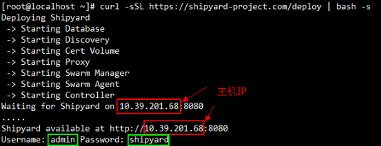
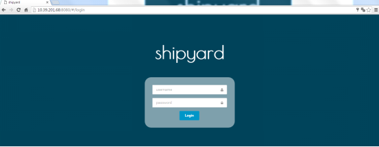
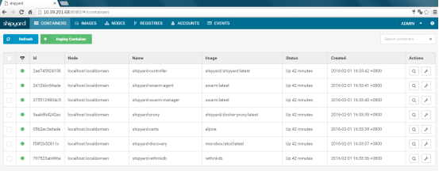

#Shipyard
Shipyard是建立在docker集群管理工具Citadel之上的可以管理容器、主机等资源的web图形化工具。包括core和extension两个版本，core即shipyard主要是把多个 Docker host上的 containers 统一管理（支持跨越多个host），extension即shipyard-extensions添加了应用路由和负载均衡、集中化日志、部署等。
##安装
官网[https://shipyard-project.com/docs/deploy/](https://shipyard-project.com/docs/deploy/ "https://shipyard-project.com/docs/deploy/") 提供手动和自动两种安装方式，经测试手动安装尚不能成功，故以下采用的是自动安装方式。安装之前需要修改两个配置。  
- 防火墙添加接口  
`firewall-cmd --permanent --zone=trusted --add-interface=docker0`  
`firewall-cmd --reload`  
- 修改docker配置文件/etc/sysconfig/docker，使其监听tcp端口，添加如下内容
`OPTIONS="-H tcp://[空/127.0.0.1]:2375 -H unix:///var/run/docker.sock"`  
- 运行安装脚本  
`curl -sSL https://shipyard-project.com/deploy | bash -s`  
该脚本会下载所需镜像，并启动容器。精简过程如下图所示（此图是在已下载所需镜像的基础上安装的输出，如第一次安装，输出会略有不同)  
  
Shipyard相关容器为自启动，即docker服务启动时自动启动  
- 使用  
通过[主机IP]:8080即可访问shipyard，默认用户名密码为：admin/shipyard  
  
登录后可以方便进行容器、镜像等操作  
  
注意：如果需要重启docker主机或docker服务，在重启后shipyard需要一定的时间约2~3min钟来初始化配置。  

##参考文档
- [https://segmentfault.com/a/1190000002464365](https://segmentfault.com/a/1190000002464365 "shipyard简介")
- [http://www.shipyard-project.com/](http://www.shipyard-project.com/ "shipyard")
