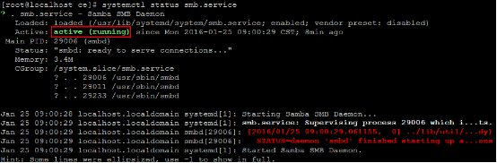

#Samba
samba可以方便的在Linux系统与windows系统之间架设共享服务。
##安装
- 以root用户登录，执行以下命令，安装samba服务  
`yum install samba samba-common`  
- 设置开机启动  
`systemctl enable smb.service`  
- 启动samba服务  
`systemctl start smb.service`  
查看状态  
`systemctl status smb.service`  

- 修改配置文件，配置共享目录  
将配置文件备份  
`mv /etc/samba/smb.conf /etc/samba/smb.conf.bak`  
在配置文件中添加如下内容  
    
	[global]  
	workgroup = WORKGROUP  
	server string = Samba Server %v  
	netbios name = centos  
	security = user  
	map to guest = bad user  
	dns proxy = no  
	`#==================== Share Definitions =================`
	[share]                   //共享/share目录，名称为share，允许任何用户访问
	path = /share
	browsable = yes
	writable = yes
	guest ok = yes
	read only = no
  
	[samba]  				 //共享/opt/test目录，名称为samba，只允许指定的用户访问
	path = /opt/test
	browsable =yes  
	writable = yes  
	guest ok = no  
	read only = no

- 创建系统用户  
`groupadd sambagroup`  
`useradd -g sambagroup sambauser`  
- 修改共享目录所有者  
`chown -R sambauser:sambagroup /opt/test`  
- 将系统用户添加到samba服务中并设置访问密码  
`smbpasswd -a sambauser`  
- 防火墙设置  
`firewall-cmd --permanent --zone=public --add-service=samba`  
`firewall-cmd --reload`  
- 重启samba  
`systemctl restart smb.service`  

- windows下访问  
`\\IP`  

##*备注*  

- windows7退出登录共享目录:  
在CMD中输入命令:  
`net use \\IP /delete`  
或者
`net use * /delete`  
- Linux系统版本为：Centos 7
